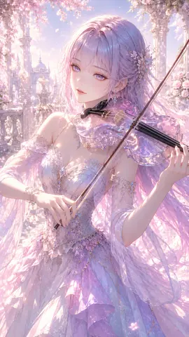

# 桜庭園の幻想ヴァイオリニスト

桜庭園の幻想ヴァイオリニストは、AICo Creation Labの投稿済み原画アーカイブから作成した軽量サムネイルです。ジャンルは立体水彩・ノーブルパステル / 3D Watercolor – Noble Pastel。Pinterest、GitHub、Patreonをつなぐ導線として、フル解像度作品や有料コレクションへの案内に使えます。 #AICoCreationLab #AIArt #DigitalArt #JapaneseArt #PinterestArt #WatercolorArt #PastelArt #3DArt #LiquidArt

## Artwork Metadata

- Genre: 3D Watercolor – Noble Pastel / 立体水彩・ノーブルパステル
- Preview size: 270 x 480px
- Original archive size: 941 x 1672px
- Source status: posted original archive
- Full-resolution direction: Patreon collection

## Links

[Official Hub](https://aico-creation-lab.musyokunoossan.chatgpt.site/) | [Patreon](https://www.patreon.com/cw/AICoCreationLab) | [Pinterest](https://jp.pinterest.com/mushoku_note_log/) | [note](https://note.com/mushoku_note_log)

## Hashtags

#AICoCreationLab #AIArt #DigitalArt #JapaneseArt #PinterestArt #WatercolorArt #PastelArt #3DArt #LiquidArt
