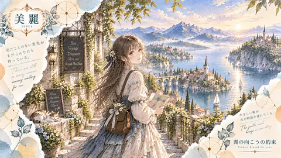

# ChatGPT 画像 2026年9月28日 13_46_46

ChatGPT 画像 2026年9月28日 13_46_46は、AICo Creation Labの投稿済み原画アーカイブから作成した軽量サムネイルです。ジャンルは立体水彩・ノーブルパステル / 3D Watercolor – Noble Pastel。GitHub Pages上の検索向けプレビューとして、フル解像度作品や有料コレクションへの案内に使えます。 #AICoCreationLab #AIArt #DigitalArt #JapaneseArt #AIArtGallery #WatercolorArt #PastelArt #3DArt #LiquidArt

## Artwork Metadata

- Genre: 3D Watercolor – Noble Pastel / 立体水彩・ノーブルパステル
- Preview size: 480 x 270px
- Original archive size: 1672 x 941px
- Source status: posted original archive
- Full-resolution direction: Patreon collection

## Links

[トップギャラリー](https://mushoku-note-log.github.io/) | [Patreonで作品を見る](https://www.patreon.com/cw/AICoCreationLab)

## Hashtags

#AICoCreationLab #AIArt #DigitalArt #JapaneseArt #AIArtGallery #WatercolorArt #PastelArt #3DArt #LiquidArt
