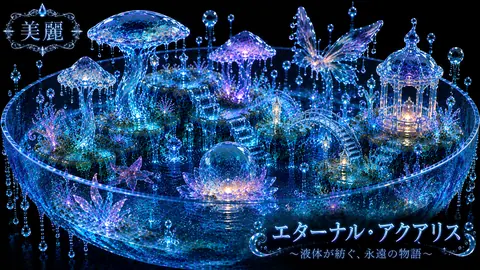

# 液晶の幻想庭園「エターナル・アクアリス」

液晶の幻想庭園「エターナル・アクアリス」は、AICo Creation Labの投稿済み原画アーカイブから作成した軽量サムネイルです。ジャンルは美麗 水・液体 / Beautiful waterliquid。Pinterest、GitHub、Patreonをつなぐ導線として、フル解像度作品や有料コレクションへの案内に使えます。 #AICoCreationLab #AIArt #DigitalArt #JapaneseArt #PinterestArt #LiquidArt

## Artwork Metadata

- Genre: Beautiful waterliquid / 美麗 水・液体
- Preview size: 480 x 270px
- Original archive size: 1672 x 941px
- Source status: posted original archive
- Full-resolution direction: Patreon collection

## Links

[Official Hub](https://aico-creation-lab.musyokunoossan.chatgpt.site/) | [Patreon](https://www.patreon.com/cw/AICoCreationLab) | [Pinterest](https://jp.pinterest.com/mushoku_note_log/) | [note](https://note.com/mushoku_note_log)

## Hashtags

#AICoCreationLab #AIArt #DigitalArt #JapaneseArt #PinterestArt #LiquidArt
