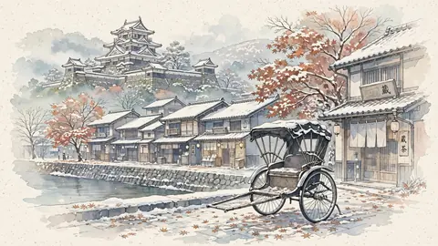

# 雪の城下町と人力車

雪の城下町と人力車 - This is a lightweight preview from a logo-free Japanese scenery stock AI art collection. Commercial use is allowed, but reselling the unmodified material itself is prohibited. / 美麗ロゴなしの日本景色フリーAI素材集から作成した軽量プレビューです。商用利用可。ただし、素材そのままで改変を行っていない素材そのものの二次販売は禁止です。 #AICoCreationLab #AIArt #DigitalArt #JapaneseArt #JapaneseScenery #LandscapeArt #JapanIllustration #FreeStock #CommercialUse

## Artwork Metadata

- Genre: Japanese Scenery / 日本の景色
- Preview size: 480 x 270px
- Original archive size: 2048 x 1152px
- Usage: Commercial use is allowed, but reselling the unmodified material itself is prohibited. / 商用利用可。未改変素材そのものの二次販売は禁止。

## Links

[Top Gallery / トップギャラリー](https://mushoku-note-log.github.io/) | [View free stock collection on Patreon / Patreonでフリー素材集を見る](https://www.patreon.com/collection/2339840)

## Hashtags

#AICoCreationLab #AIArt #DigitalArt #JapaneseArt #JapaneseScenery #LandscapeArt #JapanIllustration #FreeStock #CommercialUse
