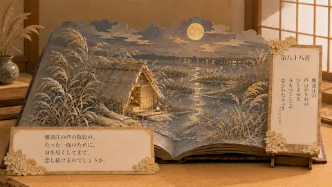

# 小倉百人一首088

小倉百人一首088 - This preview is from a logo-free commercial-use AI material collection inspired by Ogura Hyakunin Isshu, classical Japanese poetry, Heian-era atmosphere, traditional garments, seasonal imagery, and elegant Japanese scenery. Logo-free commercial-use AI material collection. Commercial use is allowed. Edited derivative use is allowed. Reselling, redistributing, re-uploading, stock/NFT/POD registration, claiming authorship, AI training, or dataset redistribution of the unmodified material itself is prohibited. / 小倉百人一首をテーマにした、ロゴなし商用利用可能AI素材集のプレビューです。美麗ロゴなしの商用利用可能AI素材集です。商用利用可。加工・編集した制作物への利用も可能です。ただし、素材そのまま、または実質的に未改変のままの転売、再配布、無断アップロード、ストック素材・NFT・POD登録、自作発言、AI学習素材やデータセットとしての再配布は禁止します。 #AICoCreationLab #AIArt #DigitalArt #JapaneseArt #AIArtGallery #OguraHyakuninIsshu #HyakuninIsshu #JapanesePoetry #HeianEra

## Artwork Metadata

- Genre: Ogura Hyakunin Isshu / 小倉百人一首
- Preview size: 480 x 270px
- Original archive size: 1672 x 941px
- Source status: posted original archive
- Full-resolution direction: Patreon collection

## Links

[トップギャラリー](https://mushoku-note-log.github.io/) | [Patreonで作品を見る](https://www.patreon.com/cw/AICoCreationLab)

## Hashtags

#AICoCreationLab #AIArt #DigitalArt #JapaneseArt #AIArtGallery #OguraHyakuninIsshu #HyakuninIsshu #JapanesePoetry #HeianEra
