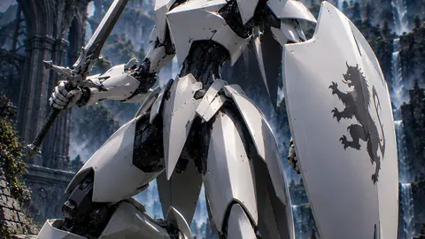

# 白騎士機ルクスティア・パラディオン

白騎士機ルクスティア・パラディオンは、AICo Creation Labの投稿済み原画アーカイブから作成した軽量サムネイルです。ジャンルは美麗ゴシックロボット / Stunning Gothic Robot。GitHub Pages上の検索向けプレビューとして、フル解像度作品や有料コレクションへの案内に使えます。 #AICoCreationLab #AIArt #DigitalArt #JapaneseArt #AIArtGallery #RobotArt #MechaArt #GothicArt

## Artwork Metadata

- Genre: Stunning Gothic Robot / 美麗ゴシックロボット
- Preview size: 339 x 480px
- Original archive size: 1054 x 1492px
- Source status: posted original archive
- Full-resolution direction: Patreon collection

## Links

[トップギャラリー](https://mushoku-note-log.github.io/) | [Patreonで作品を見る](https://www.patreon.com/cw/AICoCreationLab)

## Hashtags

#AICoCreationLab #AIArt #DigitalArt #JapaneseArt #AIArtGallery #RobotArt #MechaArt #GothicArt
